# 🎵 Pure Music

<p align="center">
  
</p>

<p align="center">
  Material You 风格的本地音乐播放器，专为 Windows 打造
</p>

<p align="center">
  
  
  
  
</p>

---

## ✨ 核心特性

| 🎨 主题系统 | 🔊 播放引擎 | 📝 歌词系统 | 🎛️ 音频控制 |
|:---:|:---:|:---:|:---:|
| Material You 动态取色 | WASAPI 独占模式 | 本地/在线歌词 | 10 段均衡器 |
| 跟随封面自动取色 | 降调调节 | 逐字歌词高亮 | 音调调节 (±12 半音) |
| 系统主题同步 | BASS_FX 音效 | 多格式歌词支持 | 预音量控制 |
| 动态/静态背景 | SMTC 系统集成 | 桌面歌词 | EQ 自动增益 |

---

## 📸 预览

### 深色模式

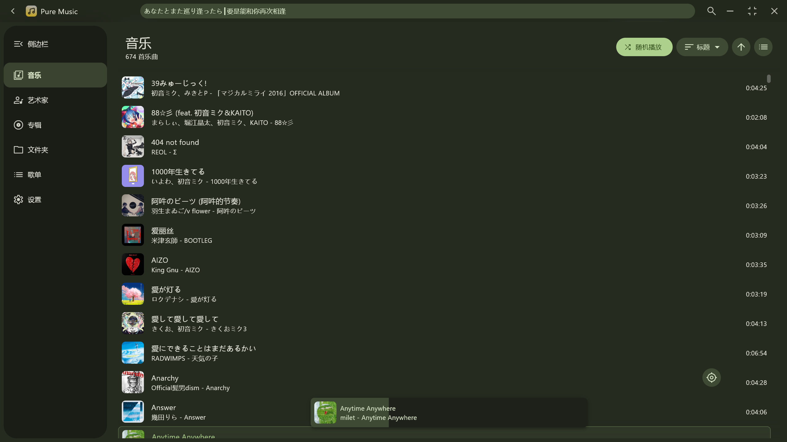
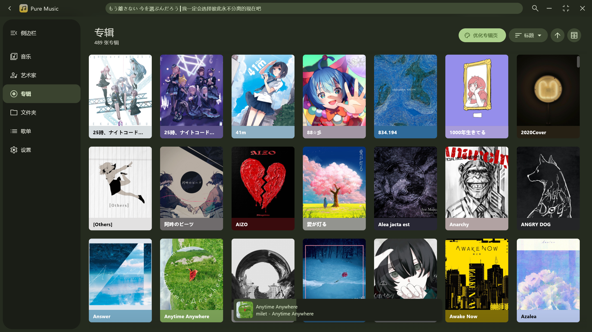
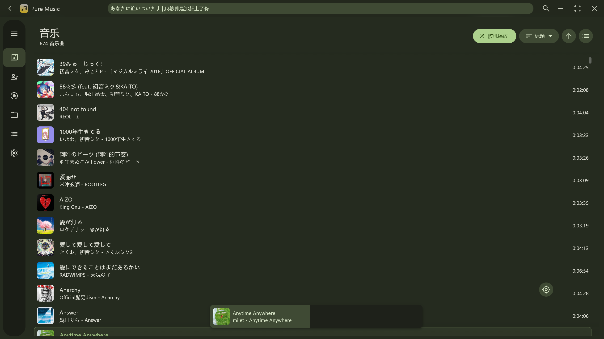
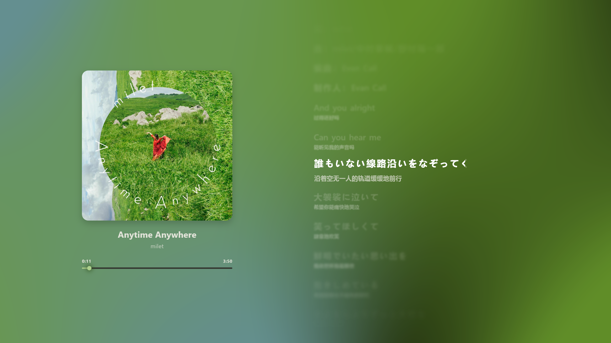
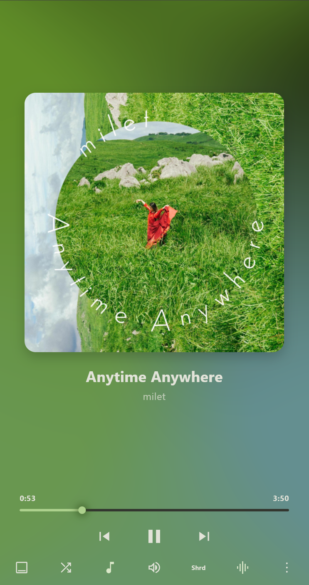
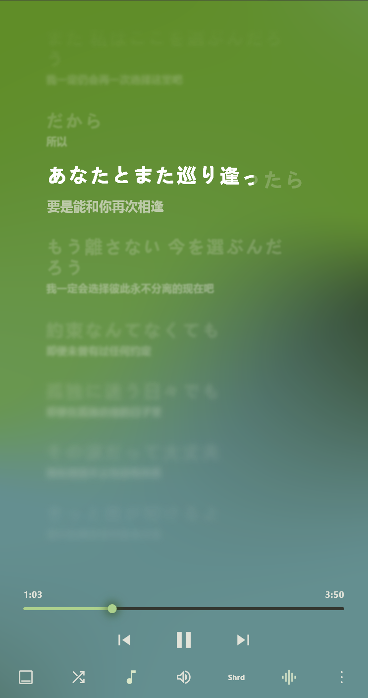
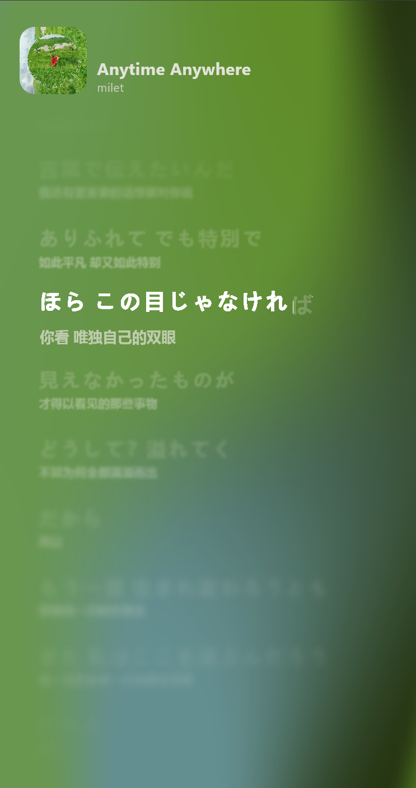

### 浅色模式

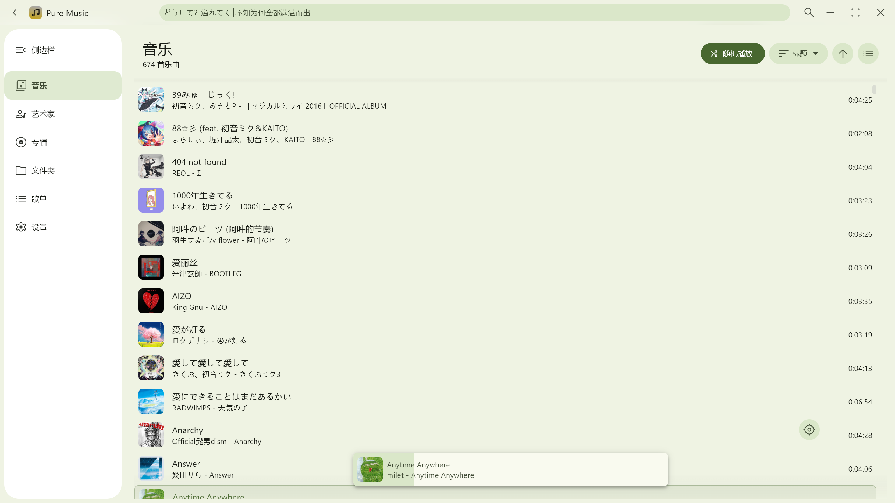
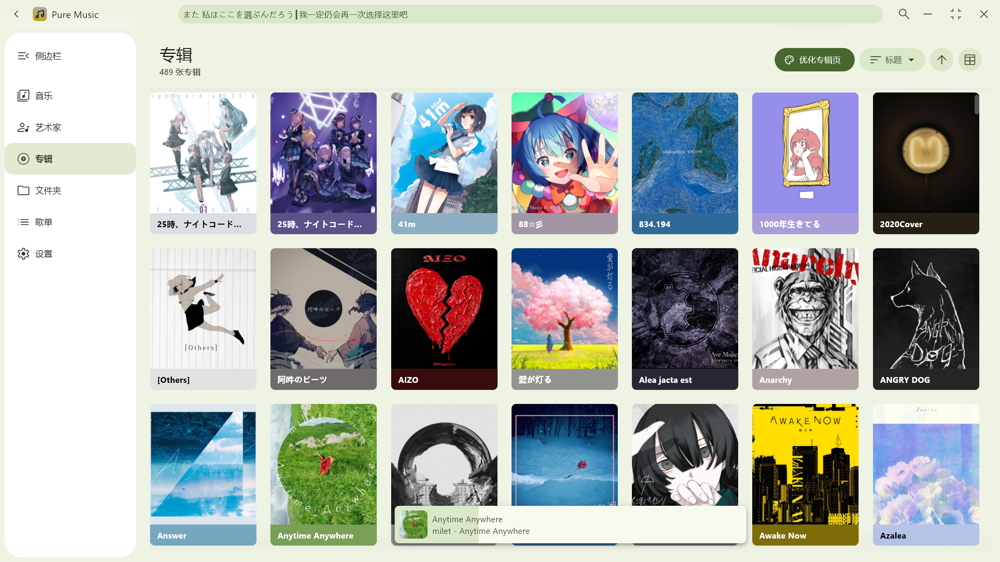
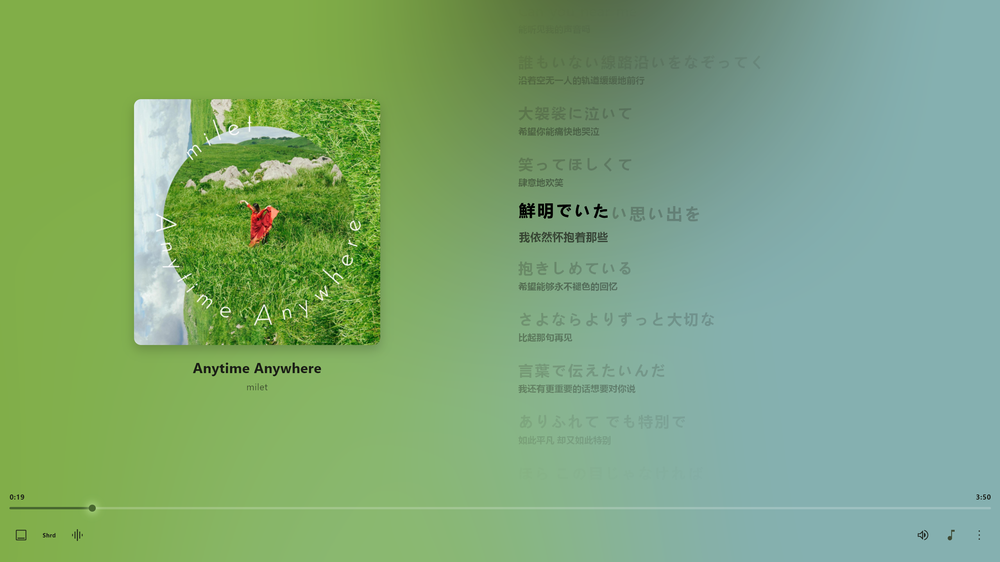 
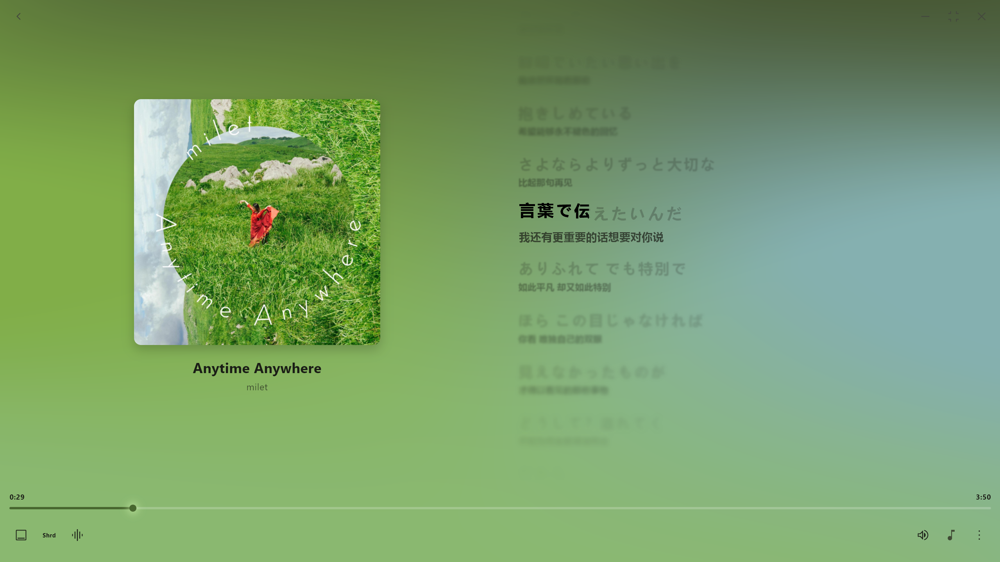
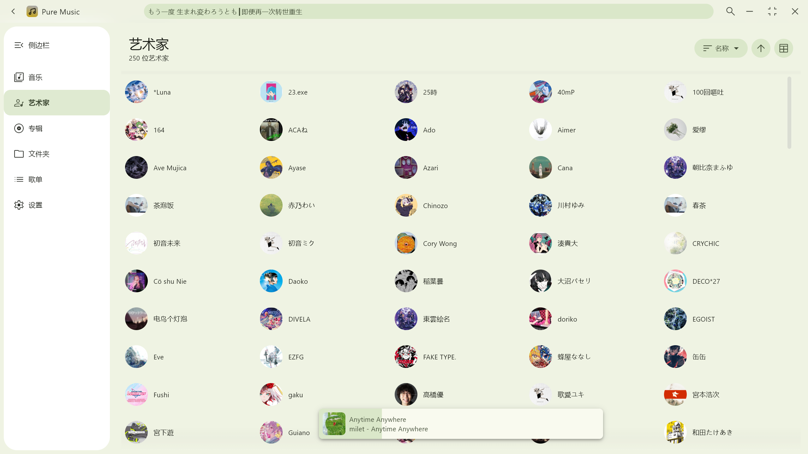

### 封面模糊效果

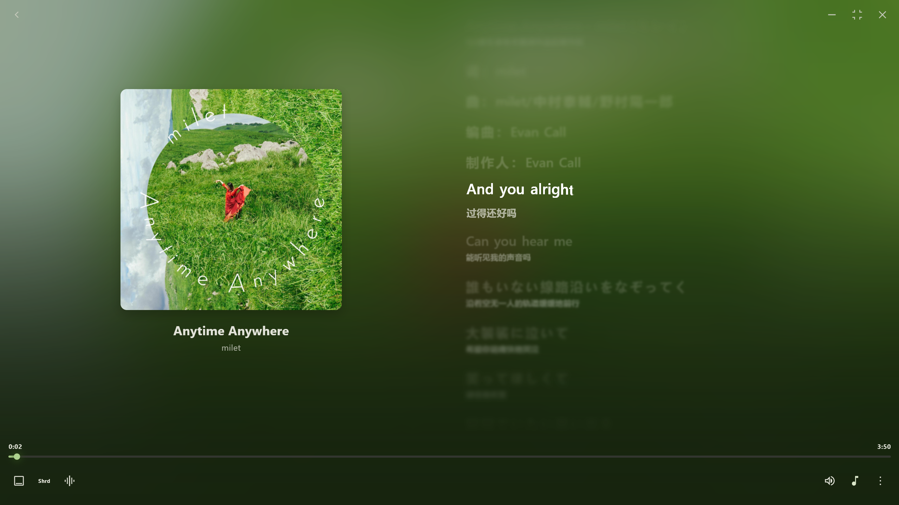
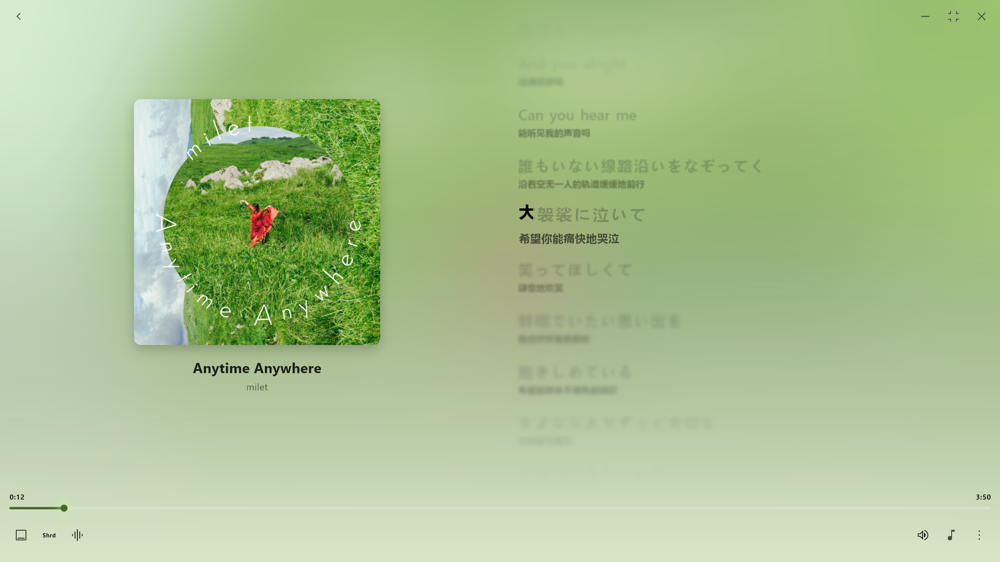

### 桌面歌词


---

## 🎯 功能列表

### 🔊 播放功能

- 播放/暂停、上一曲/下一曲、进度条拖动
- **WASAPI 独占模式** — Windows 专业音频输出
- **降调调节** — ±12 半音 Pitch 调整，基于 BASS_FX
- **多播放模式** — 顺序播放 / 列表循环 / 单曲循环
- **随机播放** — 智能打乱播放顺序
- **下一首播放** — 插入歌曲到播放队列下一位
- **会话恢复** — 自动恢复上次播放列表和进度

### 🎛️ 音频控制

- **10 段均衡器** — 80Hz ~ 16kHz 频段调节
- **EQ 预设管理** — 保存/加载/删除自定义预设
- **Wavelet AutoEq 导入** — 支持导入 GraphicEQ.txt 格式
- **批量 EQ 导入** — 从文件夹批量导入 EQ 预设
- **Preamp 控制** — ±24dB 预音量调节
- **EQ 自动增益** — 智能防止削波的自动增益控制
- **DSP 音量** — 解码级别音量控制，不影响系统音量

### 🎨 主题系统

- Material You 动态取色主题
- 跟随封面自动生成主题色
- 跟随系统深色/浅色模式
- Mesh 渐变播放背景
- 混合多层背景渲染
- 沉浸式全屏模式

### 📝 歌词功能

- 本地歌词自动匹配与显示
- 在线歌词搜索与获取（QQ音乐、网易云、酷狗）
- 逐字歌词高亮显示
- 歌词对齐方式、字号、字重可调
- **桌面歌词** — 独立窗口显示，支持主题同步
- 歌词来源查看与切换

### 🎵 音乐库管理

- 按艺术家/专辑/文件夹浏览
- 自定义播放列表管理
- 扫描进度可视化
- 统一详情页展示
- SQLite 数据库持久化

### 🔍 搜索功能

- 全局搜索对话框
- 搜索结果分类展示
- 本地音乐库搜索

### ⚙️ 系统集成

- **SMTC 集成** — Windows 系统媒体传输控制
- **系统级音量** — 应用内调节全局音量
- **快捷键支持** — 全局快捷键控制
- **快捷键反馈** — UI 悬浮提示操作
- **日志获取** — 一键导出运行日志
- **数据库迁移** — 内置数据库迁移工具

---

## 🚧 待实现/优化

- **设置持久化** — 使用 Hive 替代 JSON，提升类型安全性
- **窗口动画** — 窗口大小/位置变化平滑过渡
- **用户播放列表** — 自定义歌单系统
- **歌词防抖** — 手动滚动后自动恢复跟随
- **内存优化** — 降低整体内存占用

---

## 📁 项目结构

```
pure-music/
├── lib/                          # Flutter 主代码
│   ├── core/                     # 核心基础设施
│   │   ├── lyric/                # 歌词核心 (models, parsers, sources)
│   │   ├── net_lyrics/           # 网络歌词 (krc, qrc 解密)
│   │   ├── settings.dart         # 应用设置
│   │   ├── theme.dart            # Material You 主题
│   │   ├── hotkeys.dart          # 快捷键管理
│   │   └── system_volume_service.dart
│   ├── native/                   # 底层实现
│   │   ├── bass/                 # BASS 音频库绑定
│   │   │   ├── bass_player.dart  # 播放器核心
│   │   │   ├── bass_fx.dart      # 音效扩展
│   │   │   └── bass_wasapi.dart  # WASAPI 输出
│   │   └── rust/                 # Rust 原生 API
│   ├── component/                # 通用 UI 组件
│   ├── library/                  # 音乐库管理
│   ├── lyric/                    # 歌词解析器
│   ├── page/                     # UI 页面
│   │   ├── now_playing_page/     # 播放页面 (含均衡器、音调控制)
│   │   ├── settings_page/        # 设置页面
│   │   └── search_page/          # 搜索页面
│   └── play_service/             # 播放服务
│       ├── play_service.dart     # 播放服务入口
│       ├── playback_service.dart # 播放控制核心
│       ├── lyric_service.dart    # 歌词服务
│       └── desktop_lyric_service.dart
├── rust/                         # Rust 原生代码
├── BASS/                        # BASS 音频库插件 (C)
├── assets/                      # 资源文件
├── screenshot/                  # 截图预览
├── desktop_lyric/               # 桌面歌词二进制
└── rust_builder/                # Rust 编译工具 (cargokit)
```

---

## 支持的音频格式

基于 **BASS** 音频库:

| 格式 | 扩展名 |
|:---|:---|
| MP3 | `.mp3`, `.mp2`, `.mp1` |
| Ogg Vorbis | `.ogg` |
| WAV | `.wav`, `.wave` |
| AIFF | `.aif`, `.aiff`, `.aifc` |
| WMA | `.asf`, `.wma` |
| AAC | `.aac`, `.adts` |
| MP4 | `.m4a` |
| AC3 | `.ac3` |
| AMR | `.amr`, `.3ga` |
| FLAC | `.flac` |
| MusePack | `.mpc` |
| MIDI | `.mid` |
| WavPack | `.wv`, `.wvc` |
| Opus | `.opus` |
| DSD | `.dsf`, `.dff` |
| Monkey's Audio | `.ape` |

## 内嵌歌词支持

以下格式支持读取文件内嵌歌词:

- AAC, AIFF, FLAC, M4A, MP3, OGG, Opus, WAV (需 UTF-8 编码)

其他格式仅支持同目录 LRC 文件或网络歌词。

## 外挂 LRC 编码

- UTF-8
- UTF-16

---

## ⌨️ 快捷键

> 💡 当文本框处于输入状态时，快捷键会自动禁用。点击输入框外任意位置即可重新启用。

| 快捷键 | 功能 |
|:---|:---|
| `Esc` | 关闭弹窗 / 返回上一级 / 退出沉浸模式 |
| `Space` | 暂停/播放 |
| `Ctrl + ←` | 上一曲 |
| `Ctrl + →` | 下一曲 |
| `Ctrl + ↑` | 增加音量 (+5%) |
| `Ctrl + ↓` | 减少音量 (-5%) |
| `F1` | 切换沉浸模式 |

---

## 🚀 快速开始

### 环境要求

- Flutter 3.3+
- Rust 1.70+
- Windows 10/11

### 开发

```bash
# 安装依赖
flutter pub get

# 运行开发模式
flutter run

# 构建 Release 版本
flutter build windows --release

# 构建 Debug 版本
flutter build windows --debug
```

### Rust 相关

```bash
# 重新生成 FRB 绑定
cd rust_builder && flutter pub run build_runner build
```

---

## 🙏 致谢

### 🎨 图标

- [Silicon7921](https://ray.so/icon) — 项目图标

### 🔤 字体

- [MiSans](https://hyperos.mi.com/font/zh/) — 歌词多字重字体支持

### 📚 开源库

| 库 | 用途 |
|:---|:---|
| [dio](https://pub.dev/packages/dio) | HTTP 网络请求 |
| [BASS](https://www.un4seen.com/bass.html) | 音频播放核心 |
| [flutter_rust_bridge](https://pub.dev/packages/flutter_rust_bridge) | Flutter-Rust 跨语言调用 |
| [lofty](https://crates.io/crates/lofty) | Rust 端音频标签读取 |

### 💡 致谢

项目在开发过程中参考/使用了以下优秀的项目:

- [coriander_player](https://github.com/Ferry-200/coriander_player) — Windows 端本地音乐播放器，Material You 配色。Dart (Flutter) + Rust (lofty, windows-rs) + C (bass lib) 跨语言项目

- [ZeroBit-Player](https://github.com/Empty-57/ZeroBit-Player) — 基于 Flutter(dart) + Rust + BASS 开发的 Material 风格本地音乐播放器

---

## 📄 License

GNU General Public License v3.0 (GPL-3.0)

Pure Music 是 [coriander_player](https://github.com/Ferry-200/coriander_player) 的衍生作品。
本项目基于 coriander_player (GPL-3.0) 进行二次开发，并添加了新功能。

详细信息请参阅 [LICENSE](LICENSE) 文件。

---

<div align="center">

Made with ❤️ by qingyueyin

</div>
