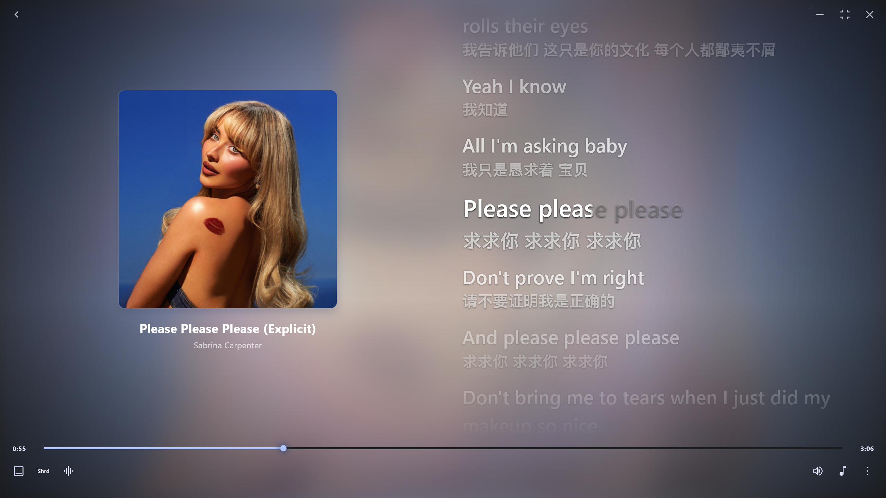
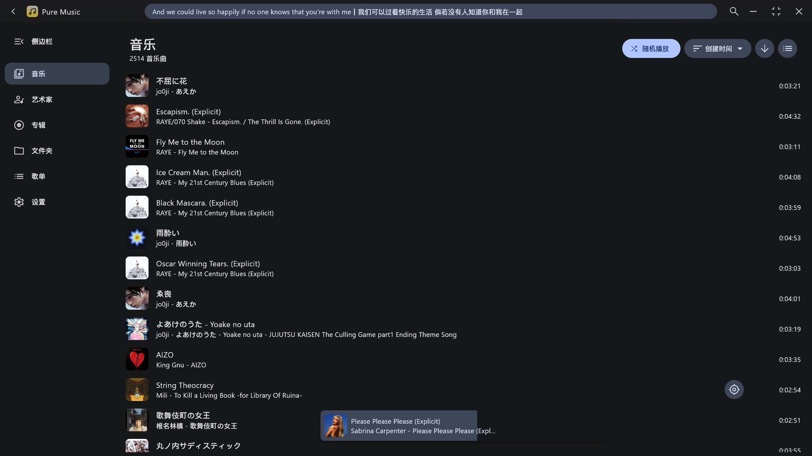
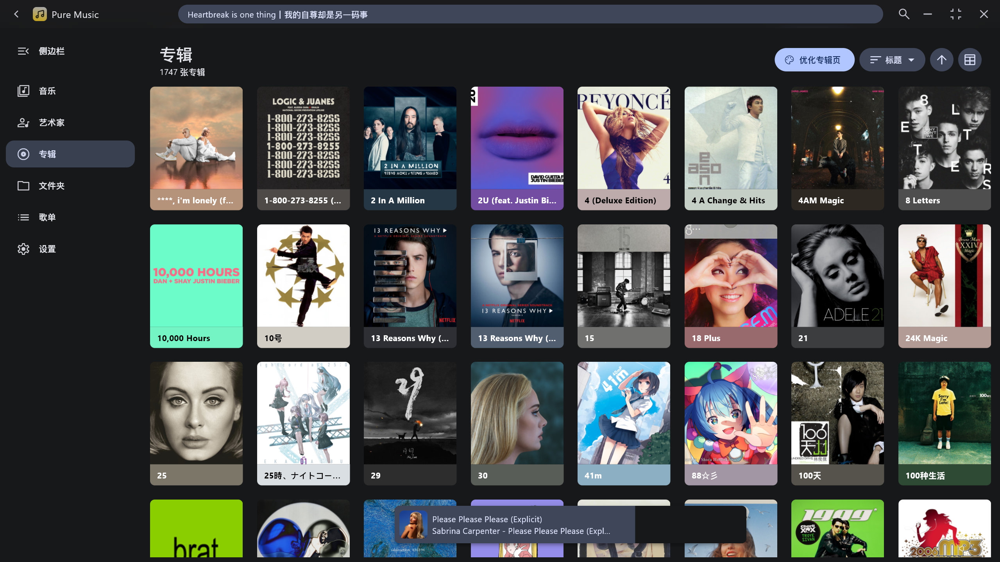
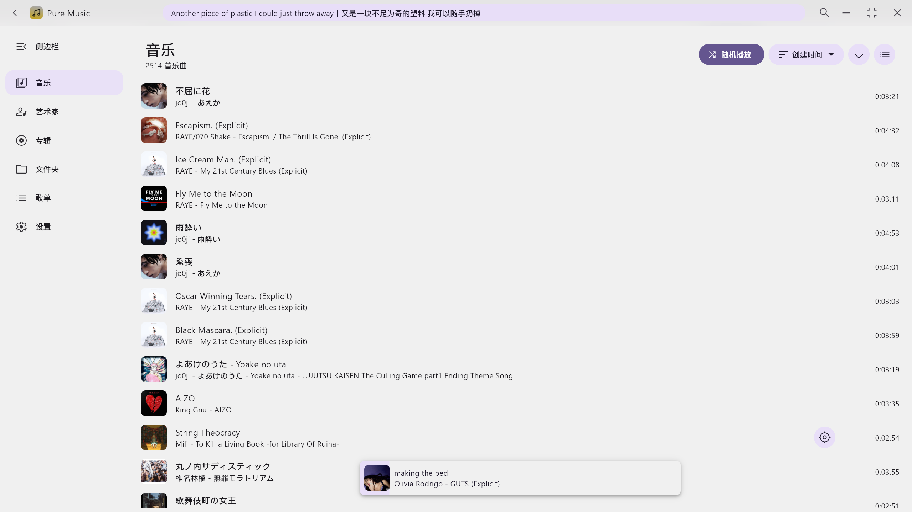
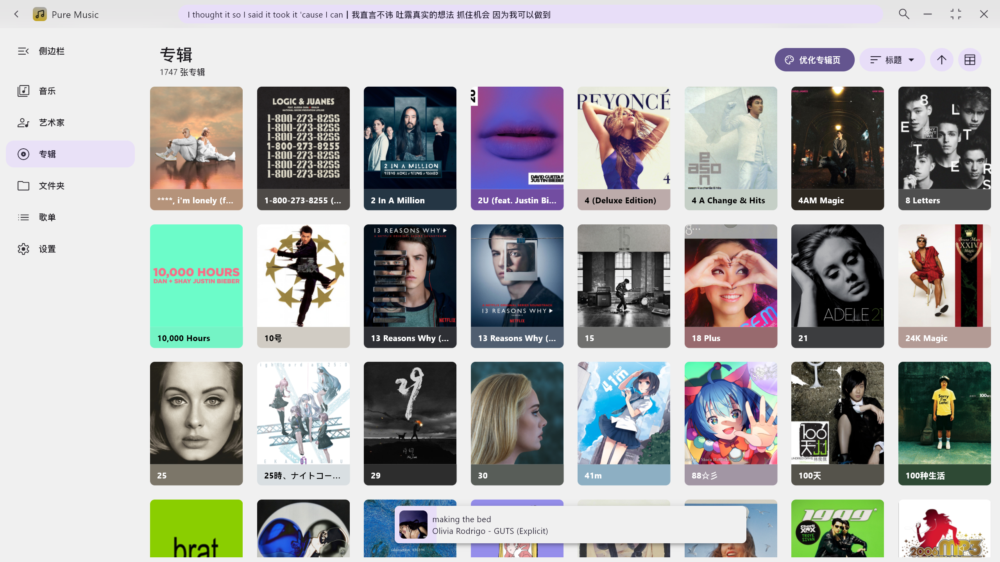
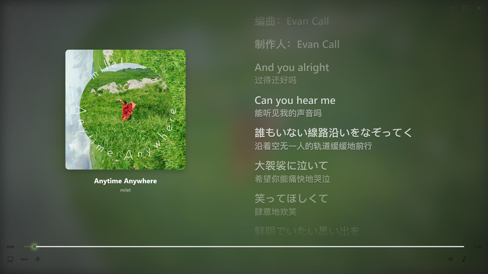
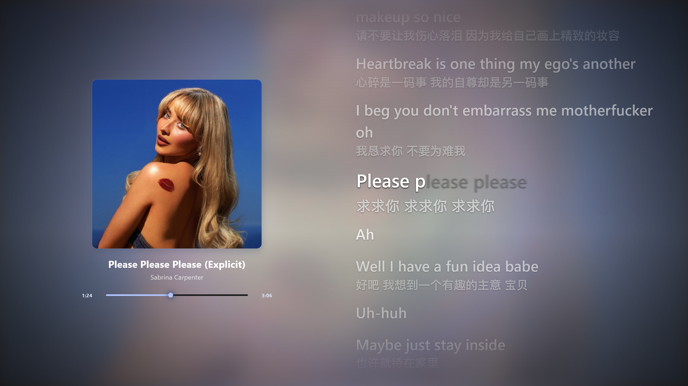
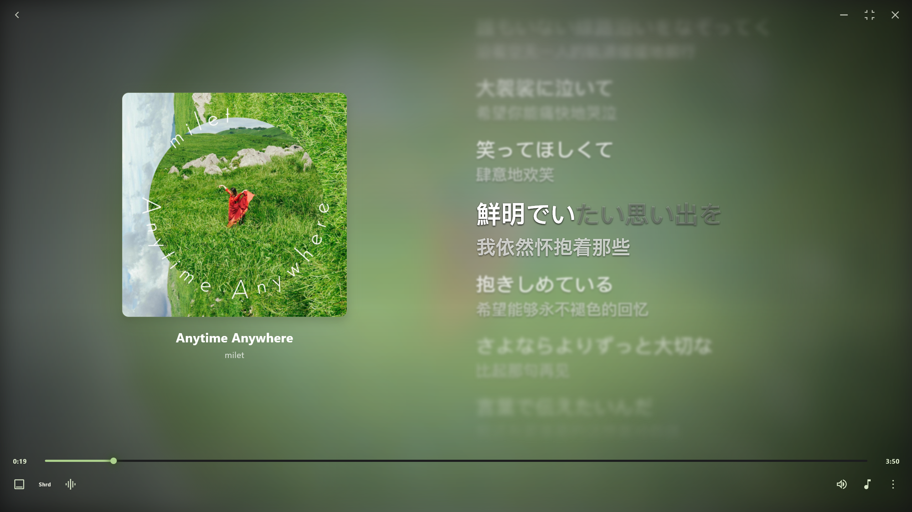

# 🎵 Pure Music

<p align="center">
  
</p>

<p align="center">
  Material You 风格的本地音乐播放器
</p>

<p align="center">
  
  
  
</p>

---

## ✨ 核心特性

<div align="center">

|        🎨 主题        |     🔊 播放     |    📝 歌词    |    ⚡ 性能     |
| :-------------------: | :-------------: | :-----------: | :------------: |
| Material You 动态取色 | WASAPI 独占模式 | 本地/在线歌词 | 流畅的播放体验 |
|     跟随封面颜色      |  降调调节  | 逐字歌词显示  | SQLite 数据库  |
|     系统主题同步      |    桌面歌词     |  多字号/字重  |                |

</div>

---

## 📸 预览

### 深色模式

 



### 浅色模式

 



### 沉浸模式 & 歌词行模糊

 

---

## 🎯 功能列表

### 🔊 播放功能

- 播放/暂停、上一曲/下一曲、进度条拖动
- **WASAPI 独占模式** — Windows 专业音频输出
- **降调/变速** — 集成 BASS_FX，支持 Pitch 调整

### 🎨 主题系统

- Material You / 动态取色主题
- 跟随封面自动生成主题色
- 跟随系统深色/浅色模式

### 📝 歌词功能

- 本地歌词匹配与显示
- 在线歌词搜索与获取
- 逐字歌词（按歌词源）
- 对齐方式、字号、字重可调
- **桌面歌词** — 可显示并跟随主题

### ⚙️ 系统集成

- **系统级音量调节** — 可通过滑动条调整全局音量
- 快捷键悬浮提示
- 数据库迁移工具
- 一键获取运行日志

---

## 📁 项目结构

```
pure-music/
├── lib/                          # Flutter 主代码
│   ├── core/                     # 核心基础设施
│   ├── native/                   # 底层实现
│   │   ├── bass/                 # BASS 音频库绑定
│   │   └── rust/                 # Rust 原生 API
│   ├── component/                # 通用组件
│   ├── library/                  # 音乐库管理
│   ├── lyric/                    # 歌词解析
│   ├── page/                     # UI页面
│   └── play_service/             # 播放服务
├── rust/                         # Rust 原生代码
├── BASS/                        # BASS 音频库插件
├── assets/                      # 资源文件
├── screenshot/                  # 截图预览
├── desktop_lyric/               # 桌面歌词二进制
└── rust_builder/                # Rust 编译工具
```

---

## 支持播放的音乐格式

基于 **BASS** :

- mp3, mp2, mp1
- ogg
- wav, wave
- aif, aiff, aifc
- asf, wma
- aac, adts
- m4a
- ac3
- amr, 3ga
- flac
- mpc
- mid
- wv, wvc
- opus
- dsf, dff
- ape

## 支持下列音乐格式的内嵌歌词

- aac
- aiff
- flac
- m4a
- mp3
- ogg
- opus
- wav（标签必须用 UTF-8 编码）

其他格式只支持同目录的 LRC 文件或者是网络歌词

## 外挂 LRC 支持编码

- utf-8
- utf-16

---

## ⌨️ 快捷键

> 💡 当文本框处于输入状态时，快捷键会自动禁用。点击输入框外任意位置即可重新启用。

| 快捷键     | 功能         |
| :--------- | :----------- |
| `Esc`      | 返回上一级   |
| `Space`    | 暂停/播放    |
| `Ctrl + ←` | 上一曲       |
| `Ctrl + →` | 下一曲       |
| `Ctrl + ↑` | 增加音量     |
| `Ctrl + ↓` | 减少音量     |
| `F1`       | 切换沉浸模式 |

---

## 🙏 致谢

### 📚 开源库

| 库                                                                  | 用途                    |
| :------------------------------------------------------------------ | :---------------------- |
| [music_api](https://github.com/yhsj0919/music_api.git)              | 歌曲匹配和歌词获取      |
| [Lofty](https://crates.io/crates/lofty)                             | 歌曲标签读取            |
| [BASS](https://www.un4seen.com/bass.html)                           | 音频播放核心            |
| [flutter_rust_bridge](https://pub.dev/packages/flutter_rust_bridge) | Flutter-Rust 跨语言调用 |

### 💡 致谢
项目在开发过程中参考/使用了以下优秀的项目:

- [coriander_player][https://github.com/Ferry-200/coriander_player] — Windows端本地音乐播放器，使用Material You配色。Dart (Flutter) + Rust (lofty, windows-rs) + C (bass lib) 跨语言项目

- [ZeroBit-Player](https://github.com/Ferry-200/zerobit) — 基于 flutter(dart) + rust + bass 开发的Material风格本地音乐播放器 

### 🎨 图标

- [Silicon7921](https://ray.so/icon) — 项目图标

### 🔤 字体

- [MiSans](https://hyperos.mi.com/font/zh/) — 歌词多字重字体支持

---

## 📄 License

MIT License

---

<div align="center">

Made with ❤️ by qingyueyin

</div>


[def]: https://github.com/Ferry-200/coriander_player