# Pure Music

<p align="center">
  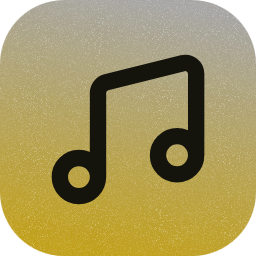
</p>

<p align="center">
  专为 Windows 打造的本地音乐播放器
</p>

<p align="center">
    
  
  
  
</p>

一款纯粹的本地音乐播放器。

---

## 截图预览

**深色模式**

<p align="center">
  
  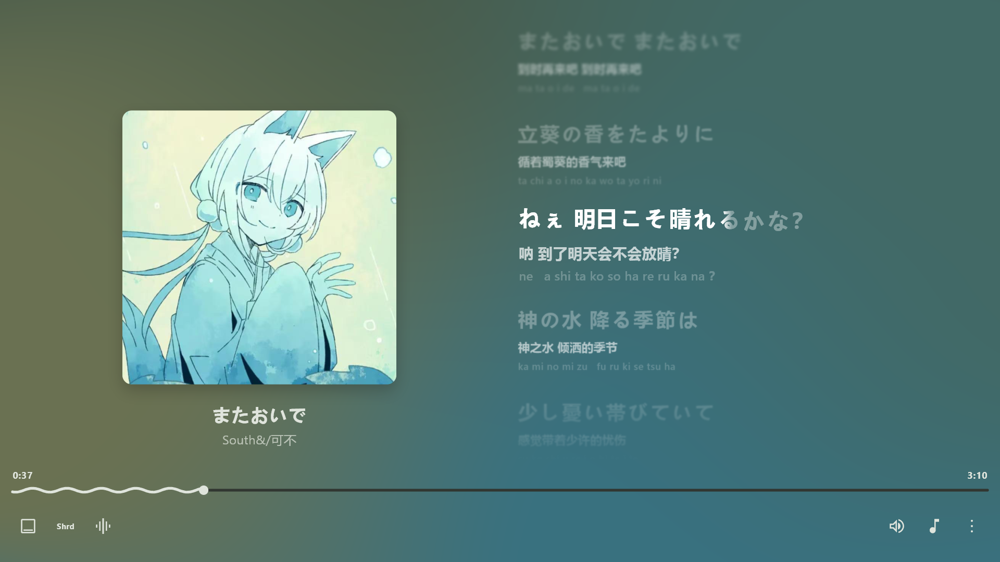
</p>

<p align="center">
  
  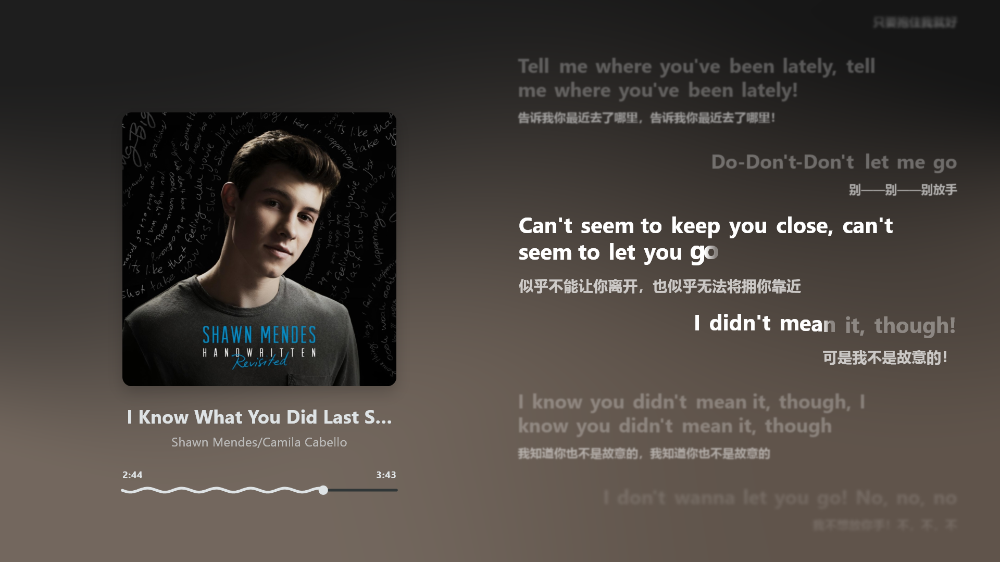
</p>

<p align="center">
  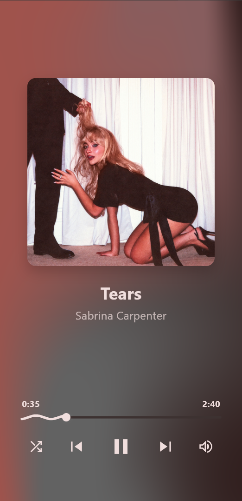
  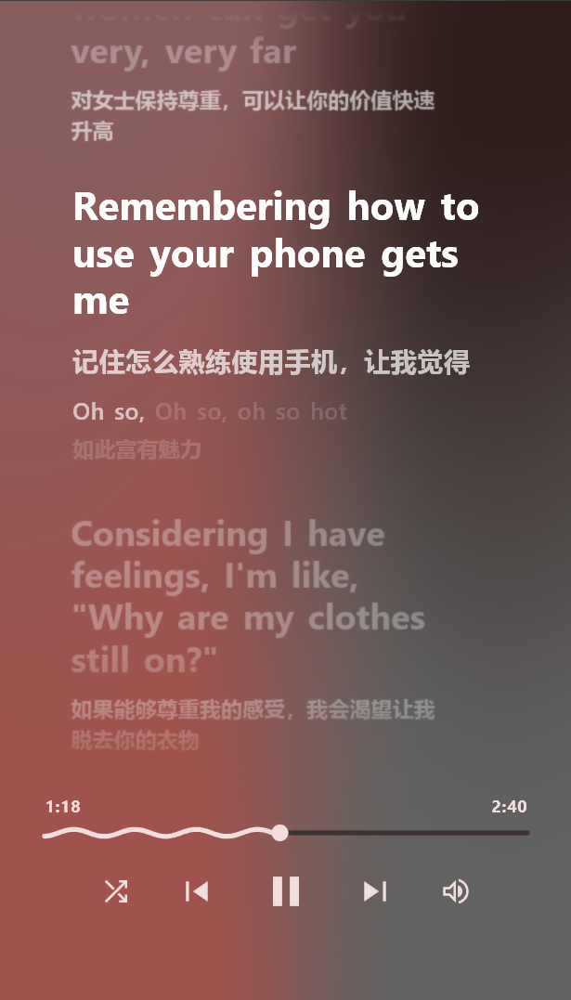
  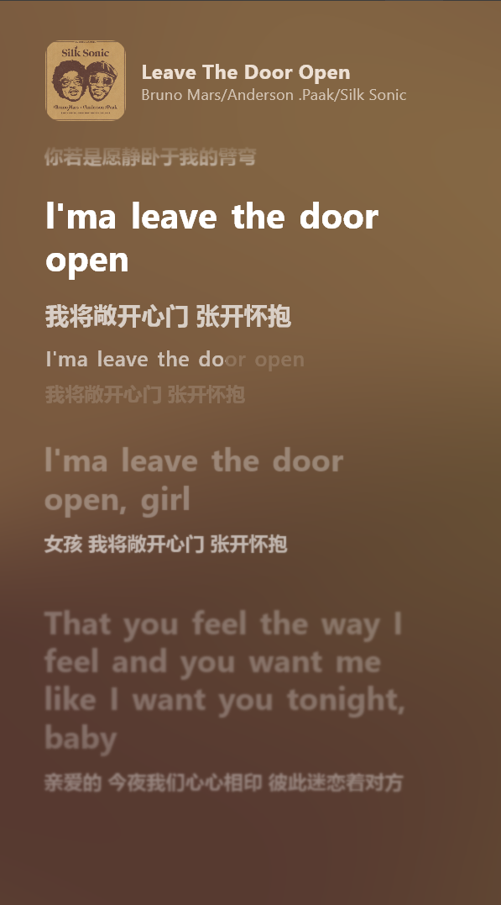
</p>

**浅色模式**

<p align="center">
  
  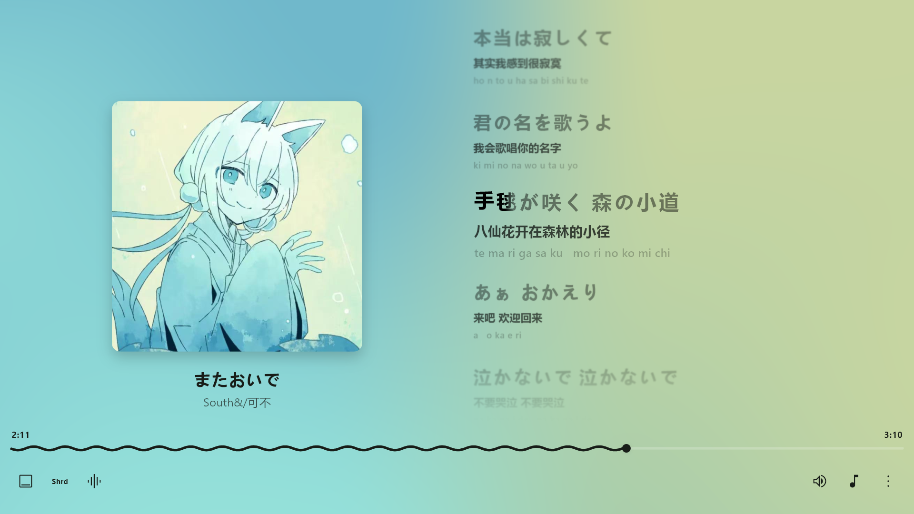
</p>

<p align="center">
  
  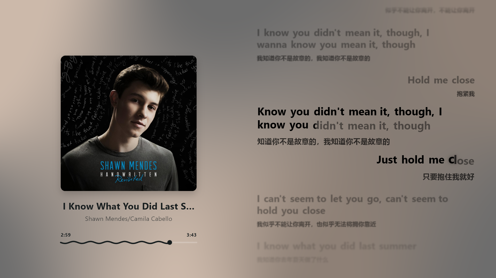
</p>

<p align="center">
  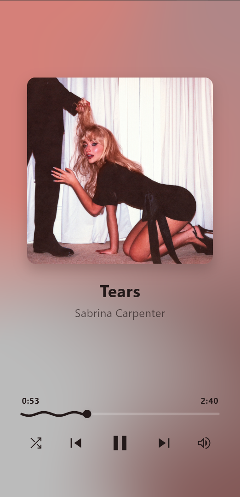
  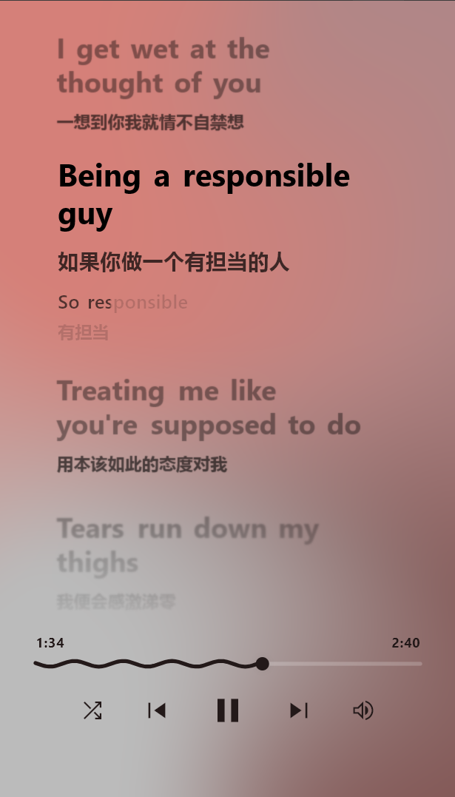
  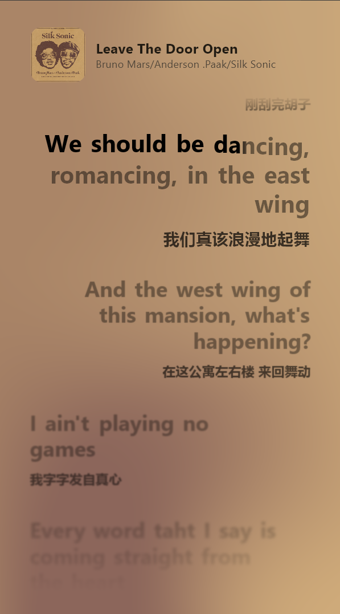
</p>

**曲库浏览**

<p align="center">
  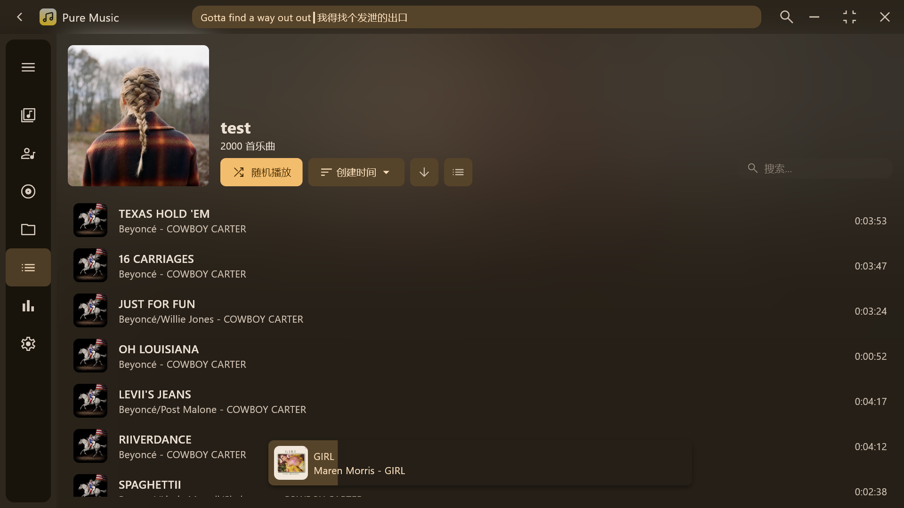
  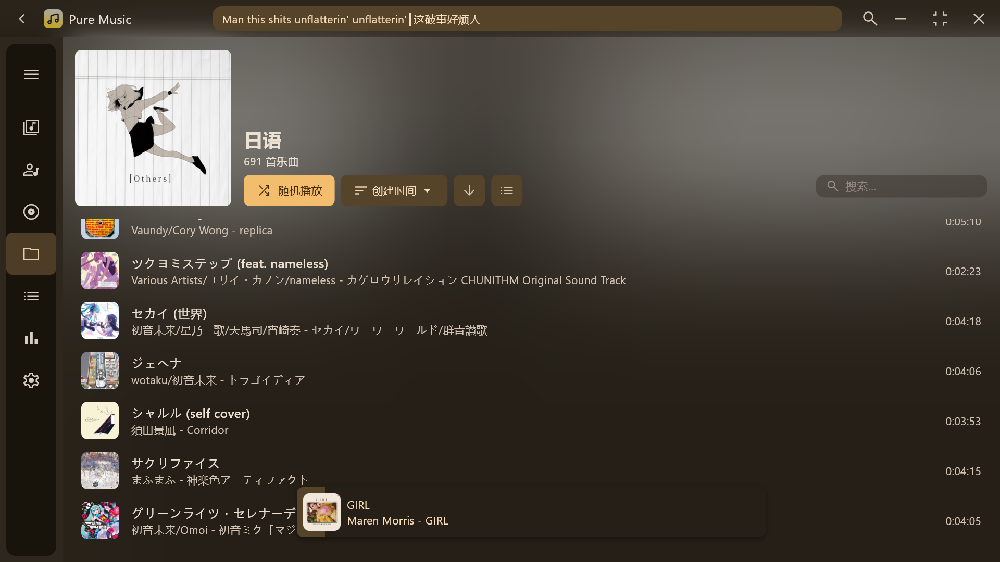
  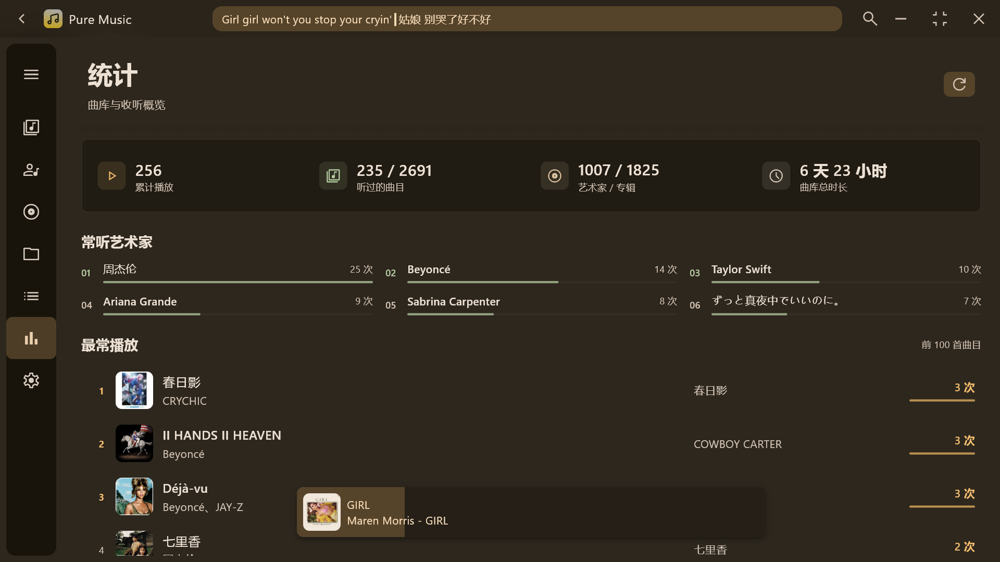
</p>

**桌面歌词样式**

<p align="center">
  
  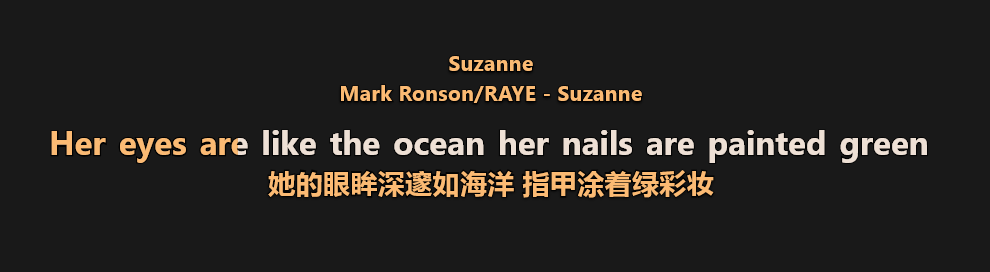
  
</p>

**媒体集成**

<p align="center">
  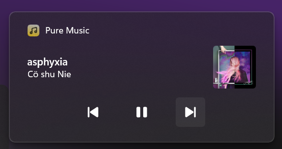
</p>

**标签编辑**

<p align="center">
  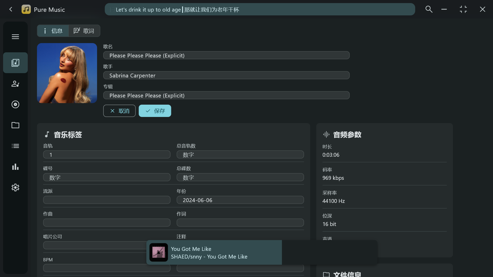
</p>

---

## 特色

**🎨 沉浸式界面** — 封面 k-means 取色驱动 Material You，动态背景，竖屏·横屏·沉浸三档响应式布局

**📝 多格式歌词** — YRC / QRC / KRC / TTML / LRC（含增强 LRC），逐字跟唱，QQ·网易·酷狗·AMLL 在线源，原文 / 翻译 / 注音并排

**🎛️ 专业音频** — 10 段 EQ、半音音调与速度、WASAPI 独占、ReplayGain

**📐 本地曲库** — 艺术家 / 专辑 / 文件夹 / 歌单 / 统计，全局搜索，会话恢复，便携或安装双数据目录

---

## 快速开始

<details>
<summary>构建流程</summary>

```bash
flutter pub get
flutter run

# 构建 Release
flutter build windows --release

# 修改 Rust 后重新生成 FRB 绑定
# 需先安装: cargo install flutter_rust_bridge_codegen
flutter_rust_bridge_codegen generate
```

</details>

<details>
<summary>功能总览</summary>

**播放** — 顺序 / 列表循环 / 单曲循环、随机、下一首播放、淡入淡出、会话恢复、迷你播放条
**音频** — WASAPI 独占、10 段 EQ（前级 / 预设 / AutoEq）、半音音调、速度、KeepPitch、ReplayGain、应用音量 + 系统音量
**主题** — Material You、封面自动取色 / 自定义固定色、系统主题同步、网格渐变与流光背景（音频律动）、主题色进度条·歌词·间奏·控件、自定义字体、沉浸模式
**歌词** — 本地外挂 + 内嵌 + 在线（QQ / 网易 / 酷狗 / AMLL）、逐字随格式、注音 / 翻译、简繁转换、行模糊、行动效、逐字上抬、辉光缩放、间奏动画、桌面歌词
**音乐库** — 歌曲 / 艺术家 / 专辑 / 文件夹 / 歌单浏览、列表·表格与排序记忆、全局搜索、歌单导出、播放统计、SQLite、封面缓存
**布局** — 响应式三档（竖屏 / 横屏 / 沉浸）、播放页仅主区 / 带歌词 / 带队列、波浪进度条分模式开关
**系统** — SMTC 媒体键、全局快捷键、单实例、窗口记忆、自动检查更新、便携 `data/` 或 `%LOCALAPPDATA%\pure_music`、回声排查日志、问题报告
**交互** — 鼠标侧键返回、长按多选 / 拖选、右键菜单、悬停显示控件、歌词点击跳转、侧栏启动页记忆

**快捷键：** `Esc` 关闭/返回、`Space` 暂停/播放、`Ctrl + ←/→` 切歌、`Ctrl + ↑/↓` 应用音量、`F1` 沉浸模式、鼠标侧键 返回

详细说明见仓库 `page/docs/guide/`。

</details>


---
## 致谢

<details>
<summary>开源库</summary>

图标：[Silicon7921](https://ray.so/icon)、字体：[MiSans VF](https://hyperos.mi.com/font/zh/)

BASS、flutter_rust_bridge、dio、lofty、provider、go_router、window_manager、hotkey_manager、flutter_single_instance、material_symbols_icons、sqlite3、file_picker、flutter_volume_controller、pinyin、fl_charset、logger、xml

</details>

<details>
<summary>参考项目</summary>

[coriander_player](https://github.com/Ferry-200/coriander_player)、[ZeroBit-Player](https://github.com/Empty-57/ZeroBit-Player)、[Lyrico](https://github.com/Replica0110/Lyrico)、[original-sound-hq-player](https://github.com/Johnwikix/original-sound-hq-player)、[SPlayer](https://github.com/imsyy/SPlayer)、[Unilyric](https://github.com/apoint123/Unilyric)


</details>

---

## Star History

[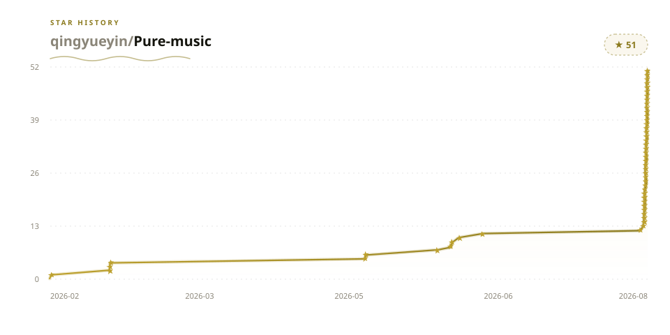](https://github.com/qingyueyin/Pure-music/stargazers)

---

## License

**GNU General Public License v3.0** — 法律上遵循此许可。

**附加要求（非法律条款，但请尊重）：**
- 本软件**仅限非商业用途**
- 若使用或修改本软件，**请注明出处**（附上本仓库链接）

Pure Music 始于 [coriander_player](https://github.com/Ferry-200/coriander_player)（GPL-3.0），历经大量重写与扩展，已成为独立发行的项目。

---

## 免责声明

- 本项目为开源学习项目，仅限个人学习、研究、交流使用，禁止用于任何商业用途
- 软件本身不包含任何音乐、歌词等版权内容，播放的是你本地已有的文件
- 在线歌词搜索的数据来自第三方平台，版权归原平台及权利人所有，仅供个人学习参考，请勿传播或商用
- 使用本软件产生的任何版权、法律问题由使用者自行承担，与项目作者无关

---

<div align="center">Made with ❤️ by qingyueyin</div>
