# 🎵 Pure Music

<p align="center">
  
</p>

<p align="center">
  Material You 风格的本地音乐播放器，专为 Windows 打造
</p>

<p align="center">
  
  
  
  
  
  
</p>

---

## 📸 预览

<details>
<summary> 🌙 深色模式 </summary>

<br>

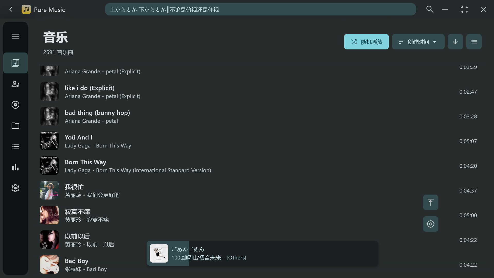
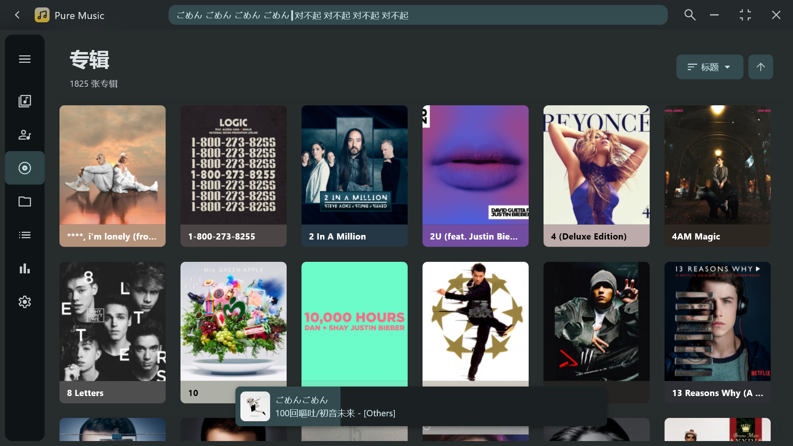
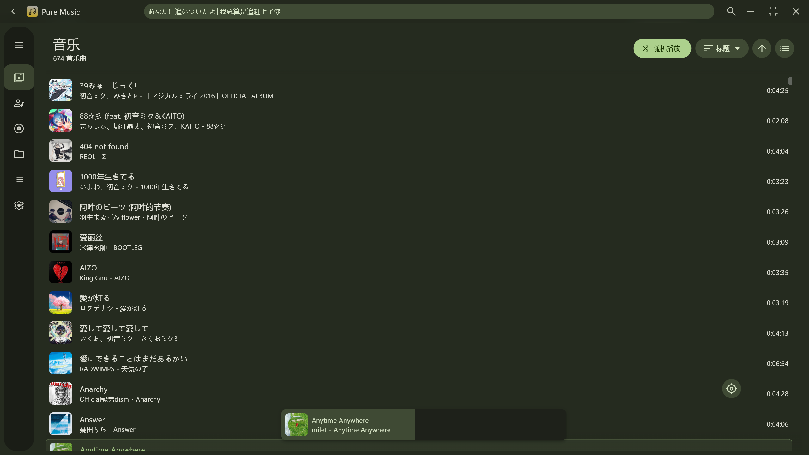
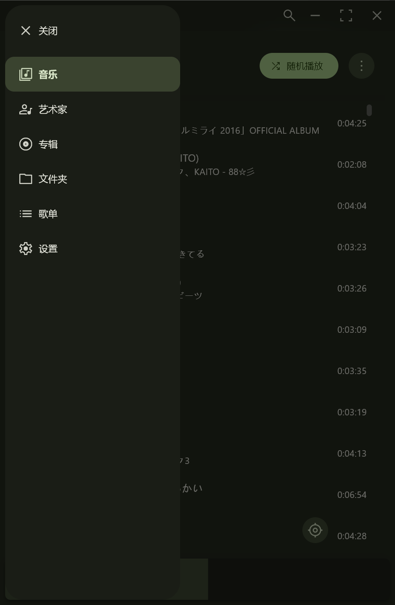
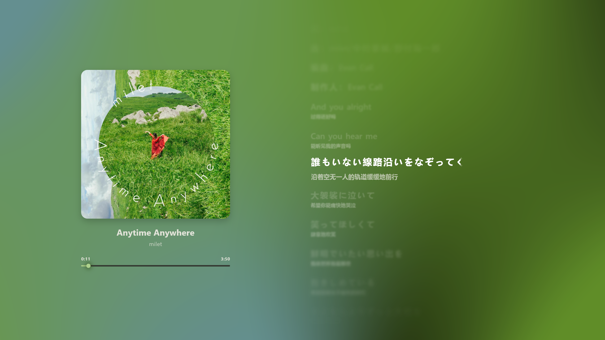
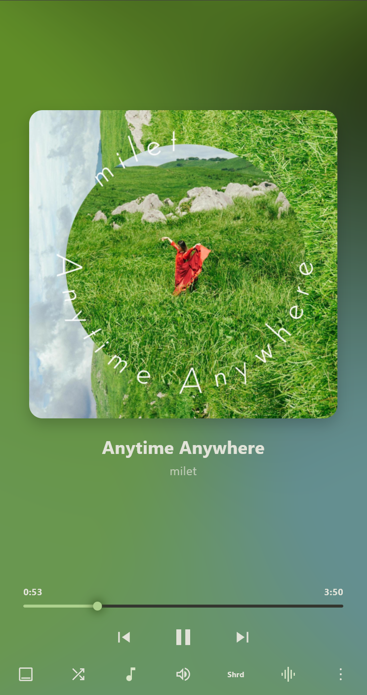
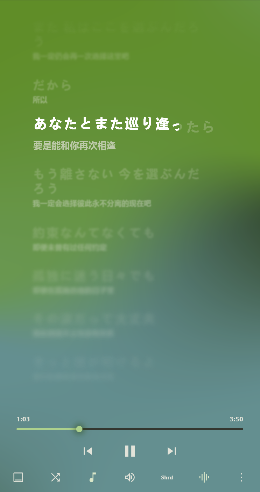
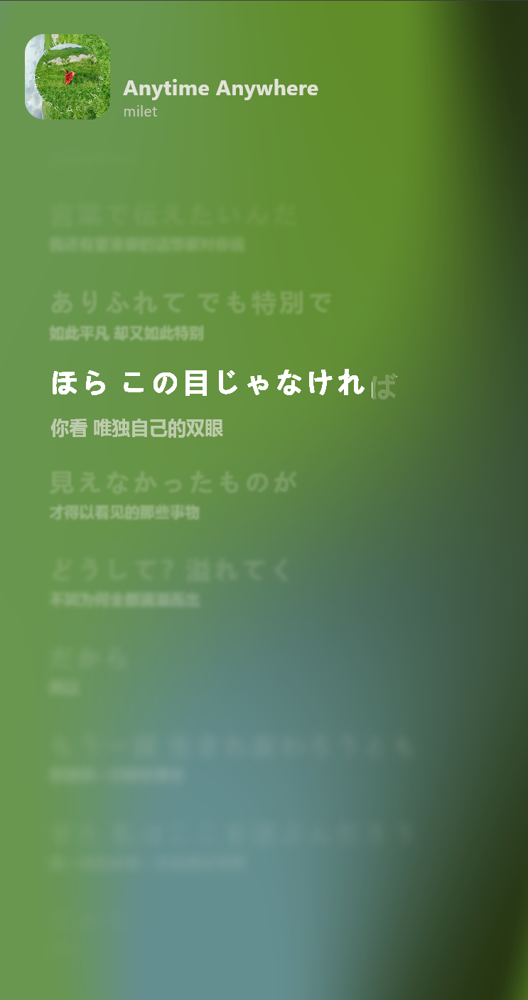

</details>

<details>
<summary> ☀️ 浅色模式 </summary>

<br>

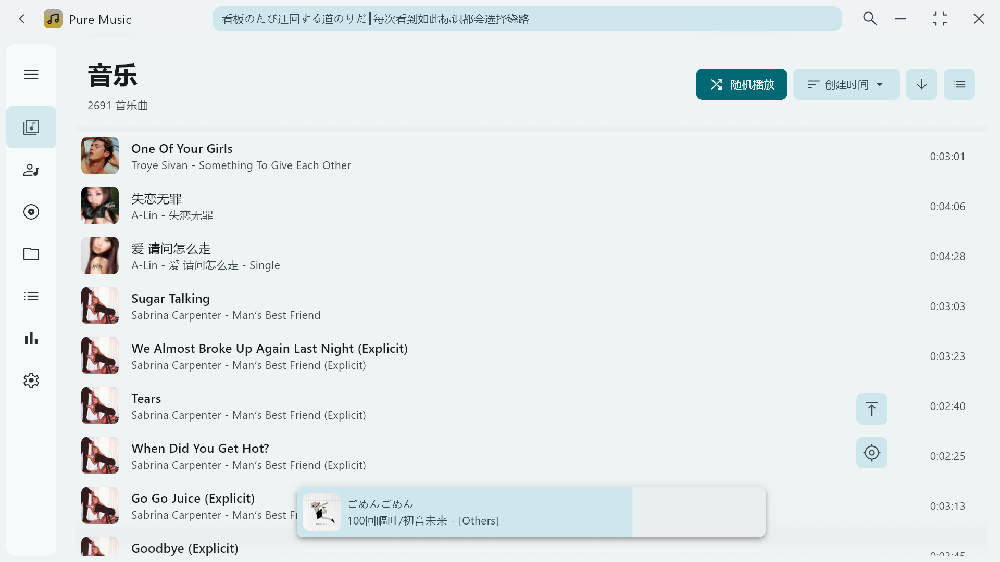
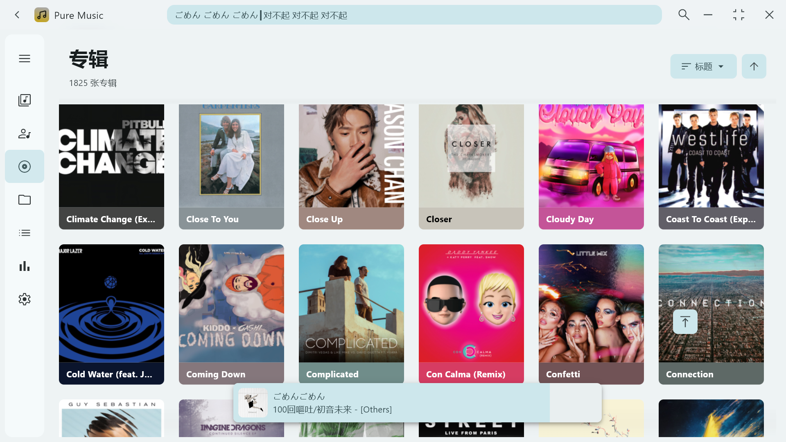
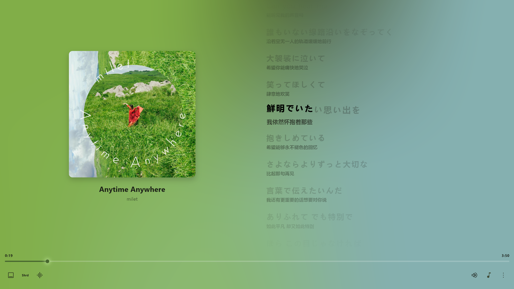 
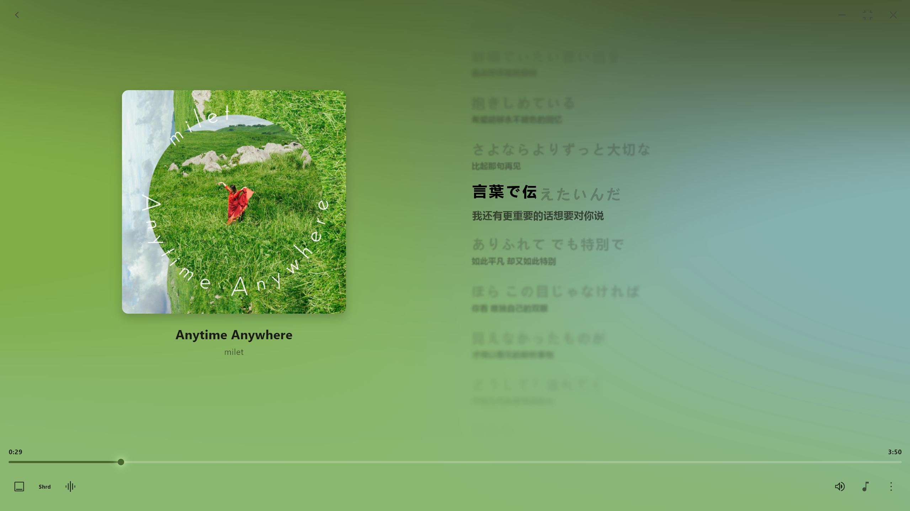
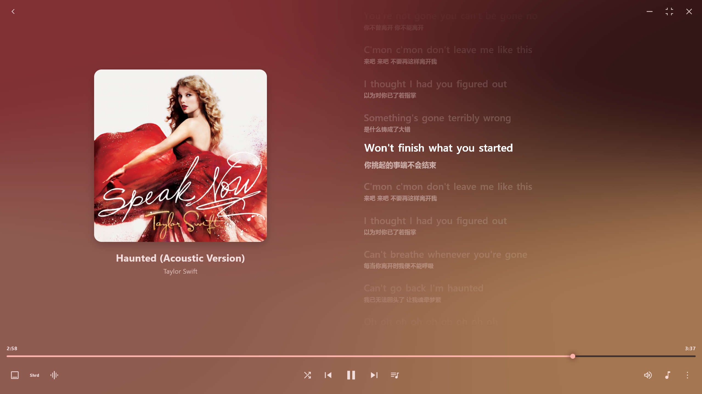
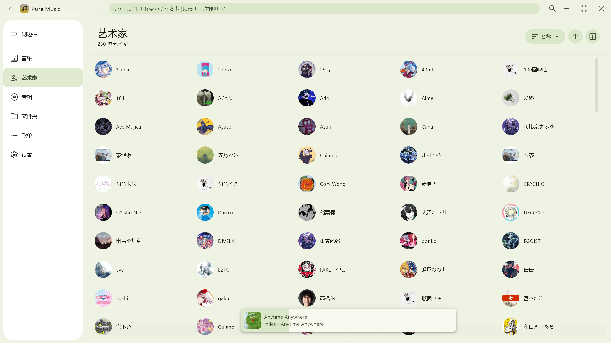

</details>

<details>
<summary> 🎨 封面模糊效果 </summary>

<br>

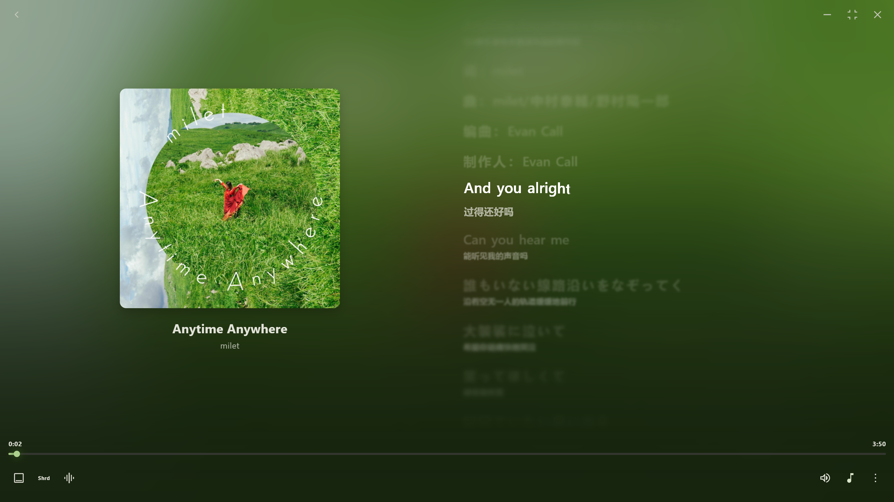
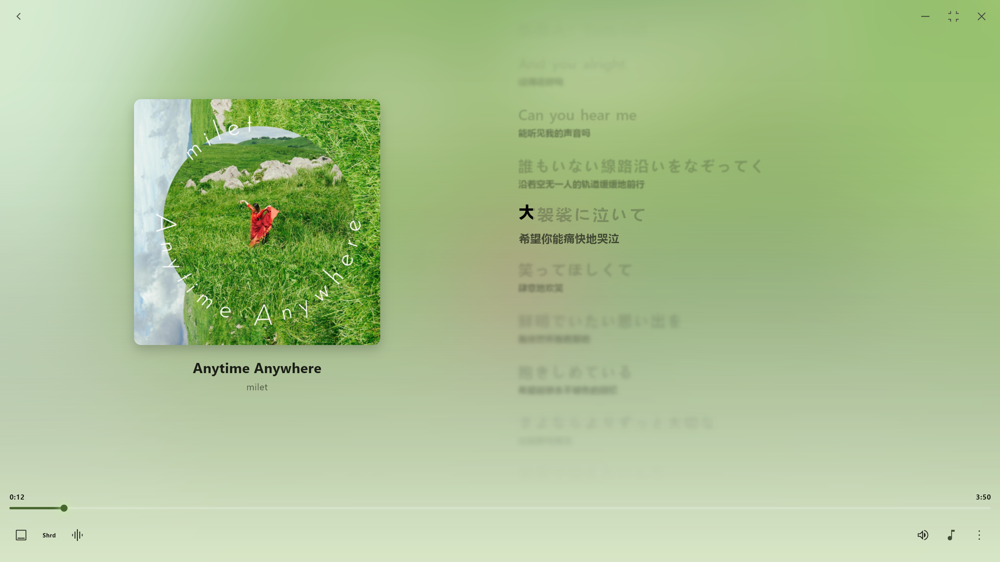

</details>

<details>
<summary> 💬 桌面歌词 </summary>

<br>


</details>

---

<details open>
<summary> 🎯 功能总览 </summary>

<br>

| 类别 | 功能 |
|:---|:---|
| 🔊 播放 | WASAPI 独占模式（缓冲+事件驱动）、交叉淡入淡出、降调/音调 ±12 半音、顺序/循环/单曲循环、随机播放、下一首播放、会话恢复 |
| 🎛️ 音频 | 10 段均衡器（80Hz~16kHz）、EQ 预设管理（保存/加载/删除）、Wavelet AutoEq 导入（单文件+批量）、Preamp ±24dB、自动增益、DSP 音量、回声日志 |
| 🎨 主题 | Material You 动态取色、封面自动取色、系统主题同步 + 手动切换、Mesh 渐变/封面模糊双背景（GLSL 渲染）、进度条/歌词/间奏莫奈取色、自定义字体、沉浸模式 |
| 📝 歌词 | 本地+在线（QQ/网易/酷狗）、逐字 KaraOK（YRC/QRC/KRC）、逐行/逐字模式、对齐/字号/字重可调、罗马音/翻译、简繁转换、空行过滤、元数据剥离（过滤脏数据）、写入标签（延迟/自动）、来源切换/首选源设置、桌面歌词（独立窗口+主题同步）、水平歌词、间奏动画、距离模糊/行缩放/音频律动、悬停高亮 |
| 🎵 音乐库 | 按艺术家/专辑/文件夹/歌曲浏览、播放列表管理、扫描进度可视化、详情页、SQLite 持久化、自定义艺术家分隔符、小封面缓存、冷数据回收 |
| 🔍 搜索 | 全局搜索对话框、分类结果展示、本地音乐库搜索 |
| ⚙️ 系统 | SMTC 集成、系统音量、全局快捷键+UI反馈、单实例、窗口记忆、便携版、日志导出、数据库迁移、检查更新（GitHub Release）、问题反馈（自动日志脱敏）、ImageCache 优化 |
| 📐 布局 | 响应式三档布局（Small ≤640 / Medium 640~1100 / Large ≥1100）、竖屏/横屏自适应 |

</details>

<details>
<summary> 🚧 待实现/优化 </summary>

<br>

- 设置持久化（Hive 替代 JSON）
- 内嵌标签编辑（封面等元数据编辑）
- Android 端适配
- 更多在线歌词源扩展
- 纯后台播放

</details>

---

<details>
<summary> 📁 项目结构 </summary>

<br>

```
pure-music/
├── lib/                              # Flutter 主代码
│   ├── core/                         # 核心基础设施
│   │   ├── settings.dart             # 应用设置
│   │   ├── theme.dart                # Material You 动态取色
│   │   ├── preference.dart           # 用户偏好持久化
│   │   ├── hotkeys.dart              # 快捷键管理
│   │   ├── enums.dart                # 全局枚举定义
│   │   ├── cache.dart                # 缓存管理
│   │   ├── database.dart             # 数据库连接
│   │   ├── color_extraction.dart     # 封面颜色提取
│   │   ├── immersive.dart            # 沉浸模式
│   │   ├── lyric_render_config.dart  # 歌词渲染配置
│   │   ├── position_provider.dart    # 播放进度状态
│   │   ├── system_volume_service.dart# 系统音量
│   │   ├── zh_converter.dart         # 简繁转换
│   │   └── utils.dart                # 工具函数
│   ├── native/                       # 底层实现
│   │   ├── bass/                     # BASS 音频库绑定
│   │   │   ├── bass_player.dart      # 播放器核心
│   │   │   ├── bass_fx.dart          # 音效扩展
│   │   │   ├── bass_wasapi.dart      # WASAPI 输出
│   │   │   └── bass.dart             # 导出入口
│   │   └── rust/                     # Rust FFI
│   │       └── api/                  # Rust API 封装
│   │           ├── library_db.dart   # 音乐库数据库
│   │           ├── tag_reader.dart   # 音频标签读取
│   │           ├── smtc_flutter.dart # SMTC 集成
│   │           ├── system_theme.dart # 系统主题检测
│   │           ├── system_volume.dart# 系统音量控制
│   │           ├── color_extraction.dart# 颜色提取
│   │           ├── installed_font.dart# 已安装字体
│   │           ├── logger.dart       # 日志
│   │           ├── kg/ne/qq.dart     # 在线歌词 API
│   │           └── utils.dart        # 工具函数
│   ├── component/                    # 通用 UI 组件
│   │   ├── app_shell.dart            # 应用主框架
│   │   ├── side_nav.dart             # 侧边导航栏
│   │   ├── title_bar.dart            # 自定义标题栏
│   │   ├── album_tile.dart           # 专辑磁贴
│   │   ├── artist_tile.dart          # 歌手磁贴
│   │   ├── audio_tile.dart           # 歌曲磁贴
│   │   ├── mini_now_playing.dart     # 迷你播放栏
│   │   ├── search_dialog.dart        # 全局搜索
│   │   ├── horizontal_lyric_view.dart# 水平歌词视图
│   │   ├── responsive_builder.dart   # 响应式布局
│   │   ├── settings_tile.dart        # 设置项组件
│   │   ├── alphabet_index.dart       # 字母索引
│   │   └── motion.dart               # 动画辅助
│   ├── library/                      # 音乐库管理
│   │   ├── audio_library.dart        # 音乐库核心
│   │   ├── playlist.dart             # 播放列表
│   │   └── union_search_result.dart  # 联合搜索结果
│   ├── lyric/                        # 歌词解析器
│   │   ├── lyric.dart                # 歌词数据结构
│   │   ├── lyric_format.dart         # 格式检测
│   │   ├── lyric_loader.dart         # 歌词加载器
│   │   ├── lyric_source.dart         # 歌词来源
│   │   ├── lrc.dart                  # LRC 解析
│   │   ├── ttml.dart                 # TTML 解析
│   │   ├── krc.dart                  # KRC 解析
│   │   ├── yrc.dart                  # YRC 解析
│   │   ├── qrc.dart                  # QRC 解析
│   │   ├── karaok_parser.dart        # 逐字歌词解析
│   │   ├── lyric_stripper.dart       # 歌词清洗
│   │   └── exclude_data.dart         # 排除数据
│   ├── services/                     # 网络服务
│   │   └── online_lyric/             # 在线歌词
│   │       ├── sources/              # 歌词源 (QQ/网易/酷狗)
│   │       ├── api/                  # 网络 API
│   │       ├── models/               # 数据模型
│   │       └── parsers/              # 响应解析
│   ├── page/                         # UI 页面
│   │   ├── now_playing_page/         # 播放页
│   │   │   ├── page.dart             # 主页面
│   │   │   ├── large_page.dart       # 大屏布局
│   │   │   ├── small_page.dart       # 小屏布局
│   │   │   ├── immersive_page.dart   # 沉浸模式
│   │   │   └── component/            # 播放页组件
│   │   │       ├── vertical_lyric_view.dart   # 纵向歌词
│   │   │       ├── lyric_view_tile.dart       # 歌词行
│   │   │       ├── lyric_view_controls.dart   # 歌词控制
│   │   │       ├── equalizer_dialog.dart      # 均衡器
│   │   │       ├── pitch_control.dart         # 音调控制
│   │   │       ├── now_playing_background.dart# 背景渲染
│   │   │       ├── mesh_gradient_background.dart # Mesh 背景
│   │   │       ├── blur_cover_background.dart # 封面模糊
│   │   │       ├── hybrid_background.dart     # 混合背景
│   │   │       ├── collapsible_lyric_controls.dart # 折叠控制
│   │   │       └── current_playlist_view.dart # 当前播放列表
│   │   ├── settings_page/            # 设置页
│   │   │   ├── page.dart             # 主页面
│   │   │   ├── settings_tabs.dart    # 设置分类标签
│   │   │   ├── other_settings.dart   # 其他设置
│   │   │   ├── artist_separator_editor.dart   # 分隔符编辑
│   │   │   ├── check_update.dart     # 更新检查
│   │   │   └── create_issue.dart     # 提交反馈
│   │   └── search_page/              # 搜索页
│   │       ├── search_page.dart      # 搜索入口
│   │       └── search_result_page.dart# 搜索结果
│   ├── play_service/                 # 播放服务
│   │   ├── play_service.dart         # 播放服务入口
│   │   ├── playback_service.dart     # 播放控制核心
│   │   ├── lyric_service.dart        # 歌词服务
│   │   ├── desktop_lyric_service.dart # 桌面歌词
│   │   └── audio_echo_log_recorder.dart # 回声日志
│   ├── entry.dart                    # 应用入口组建
│   └── main.dart                     # 启动入口
├── rust/                             # Rust 原生代码
├── BASS/                            # BASS 音频库插件 (C)
├── assets/                          # 资源文件
│   ├── fonts/MiSans/                # MiSans VF 字体
│   └── shaders/                     # GLSL 着色器
├── screenshot/                      # 截图预览
├── packages/desktop_lyric/          # 桌面歌词独立包
└── rust_builder/                    # Rust 编译工具 (cargokit)
```

</details>

<details>
<summary> 🎵 支持的音频格式 </summary>

<br>

| 格式 | 扩展名 |
|:---|:---|
| MP3 | `.mp3`, `.mp2`, `.mp1` |
| Ogg Vorbis | `.ogg` |
| WAV | `.wav`, `.wave` |
| AIFF | `.aif`, `.aiff`, `.aifc` |
| WMA | `.asf`, `.wma` |
| AAC | `.aac`, `.adts` |
| MP4 | `.m4a` |
| AC3 | `.ac3` |
| AMR | `.amr`, `.3ga` |
| FLAC | `.flac` |
| MusePack | `.mpc` |
| MIDI | `.mid` |
| WavPack | `.wv`, `.wvc` |
| Opus | `.opus` |
| DSD | `.dsf`, `.dff` |
| Monkey's Audio | `.ape` |

**内嵌歌词:** AAC, AIFF, FLAC, M4A, MP3, OGG, Opus, WAV (UTF-8)
**外挂 LRC 编码:** UTF-8 / UTF-16

</details>

---

## ⌨️ 快捷键

> 💡 当文本框处于输入状态时，快捷键会自动禁用。点击输入框外任意位置即可重新启用。

| 快捷键 | 功能 |
|:---|:---|
| `Esc` | 关闭弹窗 / 返回上一级 / 退出沉浸模式 |
| `Space` | 暂停/播放 |
| `Ctrl + ←` | 上一曲 |
| `Ctrl + →` | 下一曲 |
| `Ctrl + ↑` | 增加音量 (+5%) |
| `Ctrl + ↓` | 减少音量 (-5%) |
| `F1` | 切换沉浸模式 |

<details>
<summary> 🚀 快速开始 </summary>

<br>

**环境:** Flutter 3.3+, Rust 1.70+, Windows 10/11

```bash
# 安装依赖
flutter pub get

# 运行
flutter run

# 构建 Release
flutter build windows --release

# 重新生成 FRB 绑定（修改 Rust 后）
cd rust_builder && flutter pub run build_runner build
```

</details>

<details>
<summary> 🙏 致谢 </summary>

<br>

- 图标：[Silicon7921](https://ray.so/icon)
- 字体：[MiSans VF](https://hyperos.mi.com/font/zh/)

</details>

<details>
<summary> 📚 开源库 </summary>

<br>

| 库 | 用途 |
|:---|:---|
| [BASS](https://www.un4seen.com/bass.html) | 音频播放核心 |
| [flutter_rust_bridge](https://pub.dev/packages/flutter_rust_bridge) | Flutter-Rust 跨语言调用 |
| [dio](https://pub.dev/packages/dio) | HTTP 网络请求 |
| [lofty](https://crates.io/crates/lofty) | Rust 端音频标签读取 |
| [provider](https://pub.dev/packages/provider) | 状态管理 |
| [go_router](https://pub.dev/packages/go_router) | 路由管理 |
| [window_manager](https://pub.dev/packages/window_manager) | 窗口管理 |
| [hotkey_manager](https://pub.dev/packages/hotkey_manager) | 全局快捷键 |
| [flutter_single_instance](https://pub.dev/packages/flutter_single_instance) | 单实例运行 |
| [flutter_animate](https://pub.dev/packages/flutter_animate) | 动画引擎 |
| [mesh_gradient](https://pub.dev/packages/mesh_gradient) | Mesh 渐变背景 |
| [palette_generator](https://pub.dev/packages/palette_generator) | 封面调色板提取 |
| [material_symbols_icons](https://pub.dev/packages/material_symbols_icons) | Material Symbols 图标 |
| [sqlite3](https://pub.dev/packages/sqlite3) | SQLite 数据库 |
| [flex_color_picker](https://pub.dev/packages/flex_color_picker) | 颜色选择器 |
| [file_picker](https://pub.dev/packages/file_picker) | 文件选择 |
| [flutter_volume_controller](https://pub.dev/packages/flutter_volume_controller) | 系统音量控制 |
| [pinyin](https://pub.dev/packages/pinyin) | 拼音转换 |
| [fl_charset](https://pub.dev/packages/fl_charset) | 字符编码检测 |
| [logger](https://pub.dev/packages/logger) | 日志记录 |
| [xml](https://pub.dev/packages/xml) | XML 解析 |
| [github](https://pub.dev/packages/github) | GitHub API

</details>

<details>
<summary> 💡 参考项目 </summary>

<br>

- [coriander_player](https://github.com/Ferry-200/coriander_player) — Material You 风格的本地音乐播放器，Flutter + Rust + BASS
- [ZeroBit-Player](https://github.com/Empty-57/ZeroBit-Player) — Flutter + Rust + BASS 的 Material 风格本地音乐播放器
- [Lyrico](https://github.com/Replica0110/Lyrico) — 在线歌词搜索与获取方案
- [original-sound-hq-player](https://github.com/Johnwikix/original-sound-hq-player) — 本地音乐播放器
- [SPlayer](https://github.com/imsyy/SPlayer) — 基于 Vue + Electron 的简约音乐播放器

</details>

</details>

---

## ⭐ Star History

<a href="https://star-history.com/#qingyueyin/Pure-music&Date">
  <picture>
    <source media="(prefers-color-scheme: dark)" srcset="https://api.star-history.com/svg?repos=qingyueyin/Pure-music&type=Date&theme=dark" />
    <source media="(prefers-color-scheme: light)" srcset="https://api.star-history.com/svg?repos=qingyueyin/Pure-music&type=Date" />
    
  </picture>
</a>

---

## 📄 License

GNU General Public License v3.0 (GPL-3.0)

Pure Music 始于 [coriander_player](https://github.com/Ferry-200/coriander_player)（GPL-3.0），历经大量重写与扩展，已成为独立发行的项目。

详细信息请参阅 [LICENSE](LICENSE) 文件。

---

<div align="center">

Made with ❤️ by qingyueyin

</div>
